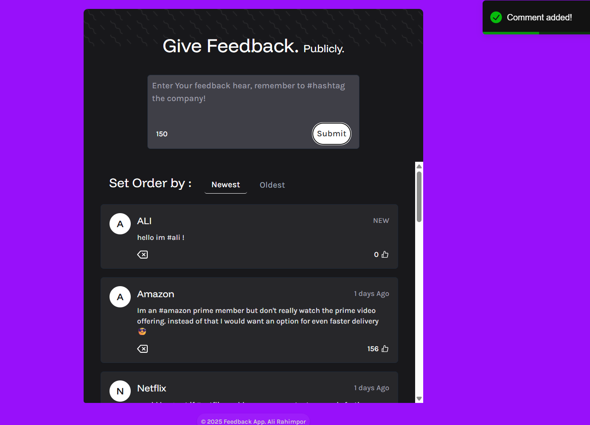
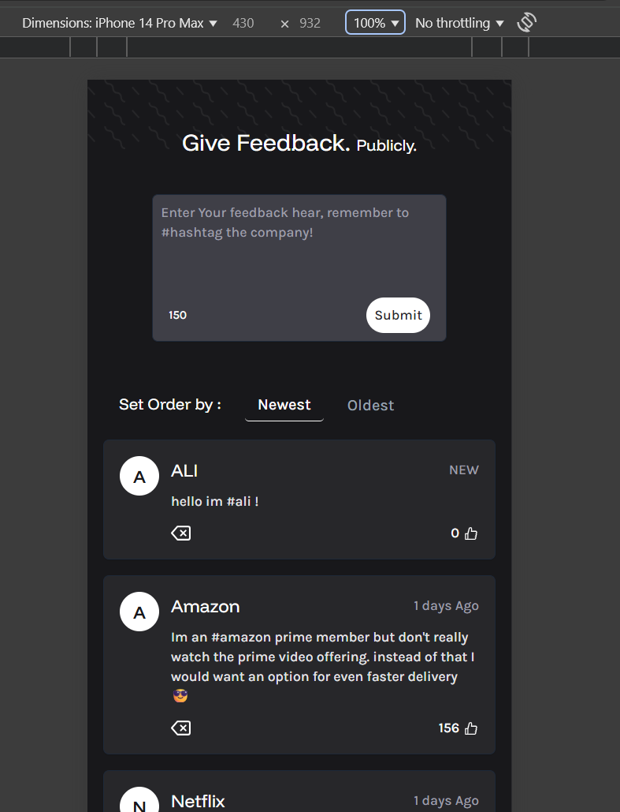

# FeedBack

A frontend project built with **React + Vite + TypeScript** for displaying and managing user feedback.

[Live Demo](https://ali-rahimpoor.github.io/FeedBack/)

## Features

- ⚛️ Built with React 19  
- 🚀 High performance with Vite  
- 🔧 State management using Redux Toolkit  
- 🎨 Responsive design using TailwindCSS  
- 🔔 Notifications via React Toastify & SweetAlert2  
- ✅ Type-safe development with TypeScript  
- 🔍 Code linting using ESLint  

## Prerequisites

- Node.js (v18 or higher)
- npm or yarn

## Screenshots

### 🖼️ Homepage





## Installation

```bash
git clone https://github.com/Ali-Rahimpoor/FeedBack.git
cd FeedBack
npm install

